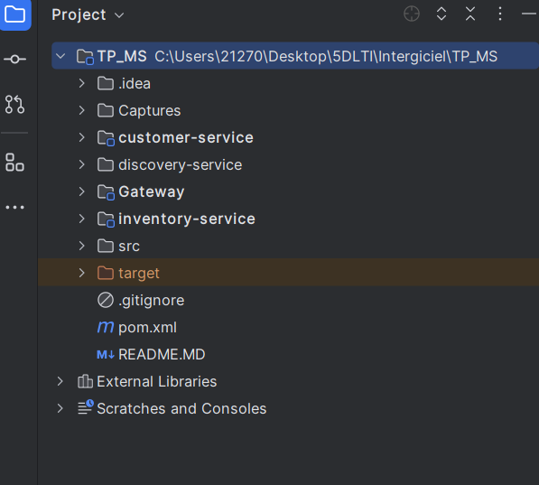
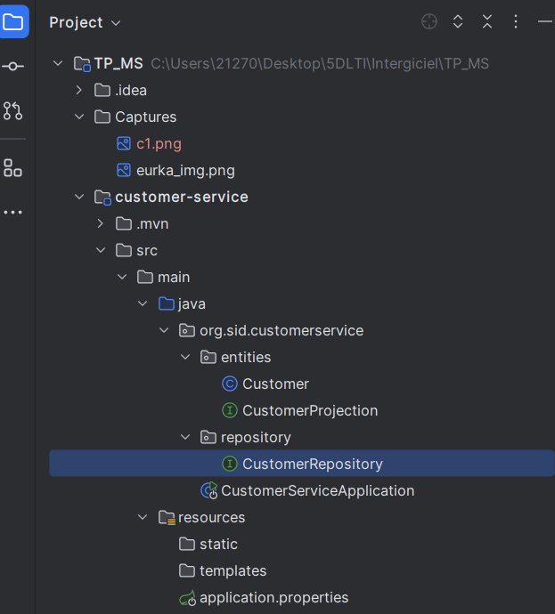
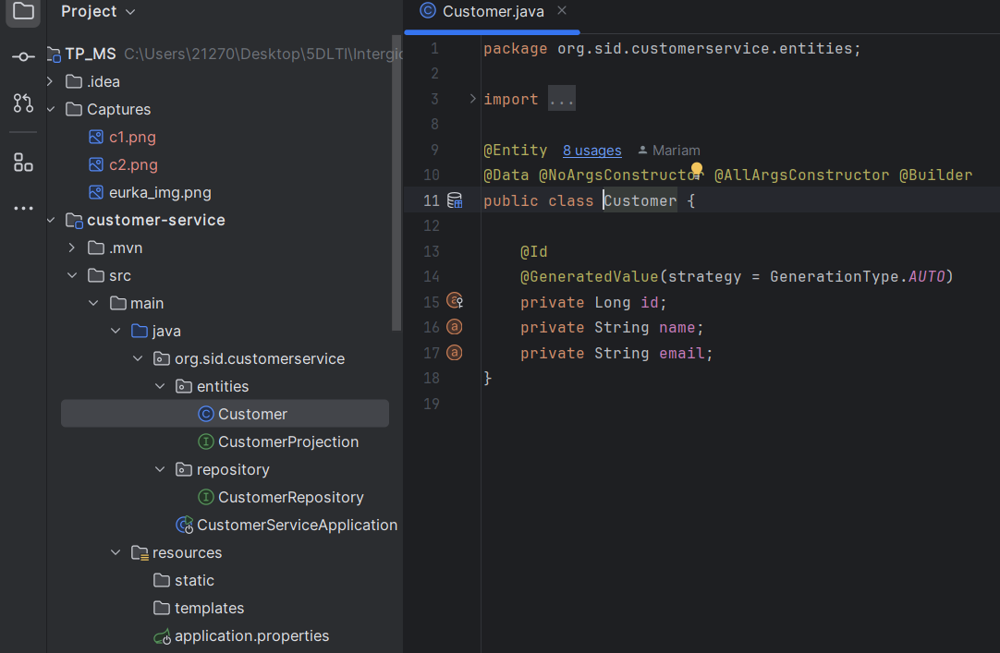
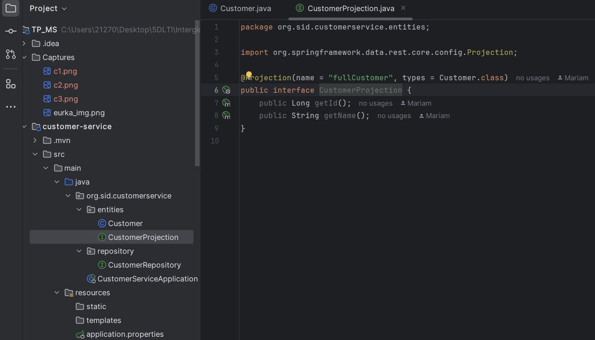
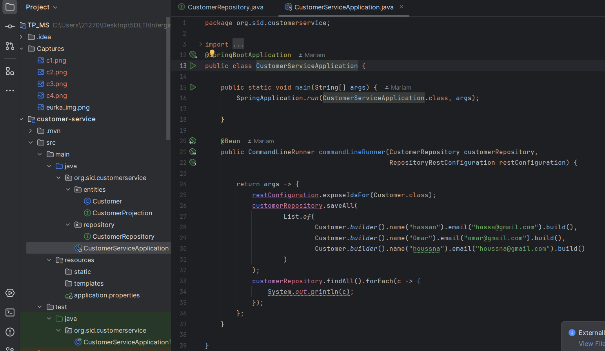
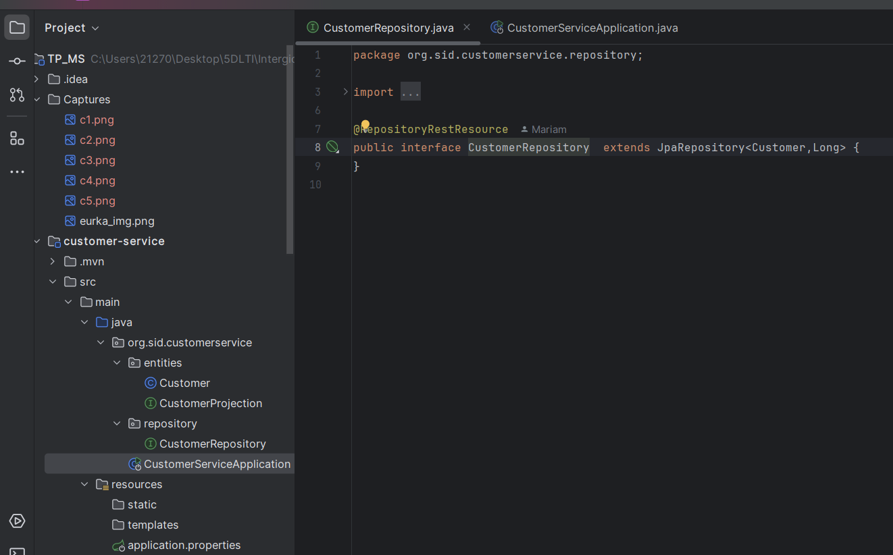
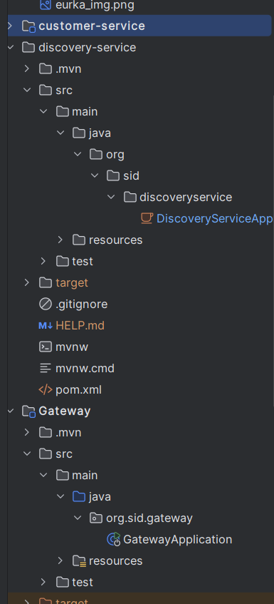
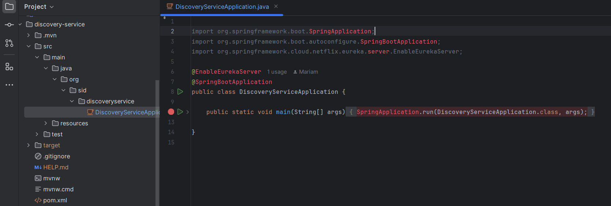
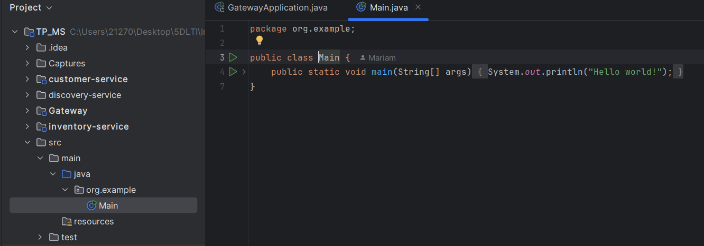

<h2>Les captures du TP3 MicroService</h2>

<h2>Structure du prjet</h2>

<h2>Structure et code de customer-service</h2>

<h2>Structure et code de discovery-service</h2>

<h2>Structure et code de gateway</h2>

<h2>Structure et code de inventory-service</h2>

<h2>Test avec Spring Eureka</h2>
